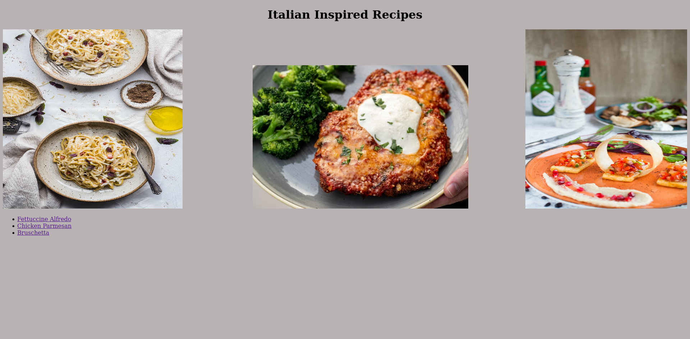
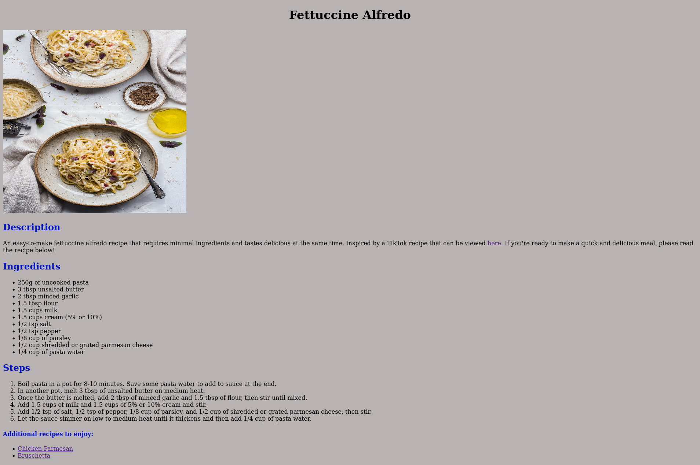

# My Amazing Project: Italian Inspired Recipes Website
I created an Italian inspired recipe website with my most favorite, delicious, and easy-to-make recipes.

**Link to project:** https://github.com/chantelspicer/odin_recipes

## How It's Made:

**Tech used:** HTML, CSS, VSCode, Git, and GitHub

I began by creating an index.html file, along with three seperate HTML files for my recipes to ensure seperation and organization of my content. I incorporated appropriate HTML structure and included a main H1 heading for the titles of each recipe. Along the way, I learned how to debug my errors and how to link pathways to ensure HTML, images, and CSS were linked correctly. Through my enhanced knowledge of CSS, I also learned how to incorporate CSS declarations using appropriate classes, ID's, tags and the importance of specificity. Once completed, I used git commands within the terminal to add, commit, and push my project from my local machine using Linux to GitHub.

## Optimizations:

My original Italian Inspired Recipes website used strictly HTML, however once I learned CSS, I revisited my website to include a variety of classes, ID's, and tags within my linked style.css page to stylize my website for a more creative approach. One of the optimizations I included was my knowledge that even if images are planned to remain the same size, it is still best practice to include a height and width so that space on the page is reserved for the images, thereby allowing the page to load smoothly.

## Lessons Learned:

My first challenge was using the terminal on Linux or within VSCode to create directories, files, and learning how to clone from GitHub with an SSH clone link, then adding, committing, and pushing the code from my terminal on Linux to GitHub. I enjoyed using the terminal as it provided me with another perspective of how directories and files are created in the backend rather than right-clicking to create one myself. In the end, I am excited with the progress I have made and look forward to enhancing my knowledge and skills coding.

## Examples:
Take a look at my GitHub portfolio:

**GitHub Portfolio:** https://github.com/chantelspicer